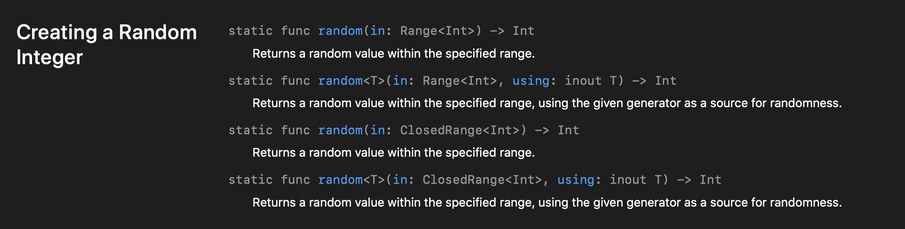
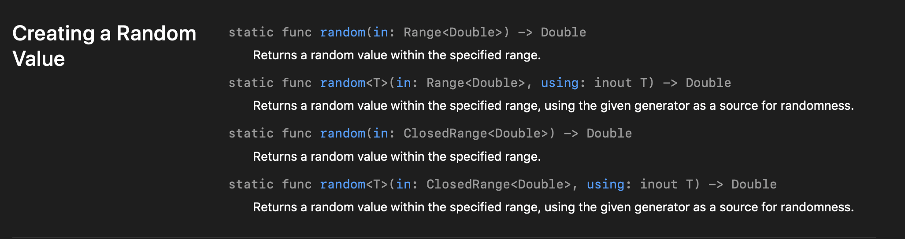
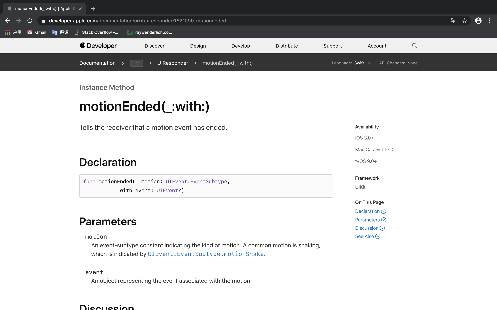

# 摇骰子App

## 查找16进制颜色值网站

* FLAT UI COLORS 2 网址： https://flatuicolors.com

## 傻瓜式制作APP图标网站

* Canva 网址 www.canva.com，用于制作一个图标。通常图标的大小应该选为 1024 x 1024
* App Icon Generator 网址：appicon.co 可以生成不同尺寸的图标文件。

## 查找一些不熟悉的API的策略

在Google上搜索需要的功能，例如 shake，然后加上后缀 apple documentation。

如： `shake apple documentation`

不用在文档内搜索，文档内搜索通常都不太准确。Google的结果更为准确。

## 如何生成一个随机数？

在以前Java或是Python的经验中，通常我们都需要使用`Math.random()`函数来生成一个随机数。但是在Swift中不是这样的。Swift中如果要生成随机数，只需要使用对应类型的random方法就行。按Lebus的话来说，这也是一种编程思维。我们想要获取一个整型随机数，那么就应该是 `Int.random()`这样来猜测一下。

```swift
Int.random(0...5) //生成范围在[0,5]中的一个随机数（整型）。
```



在其他数值类型中，也有这个`random`方法来生成对应类型的随机数。例如Double：



## 怎样监听设备摇晃？

利用我们之前说的策略，直接google：shake apple documentation，然后选择第一个：



