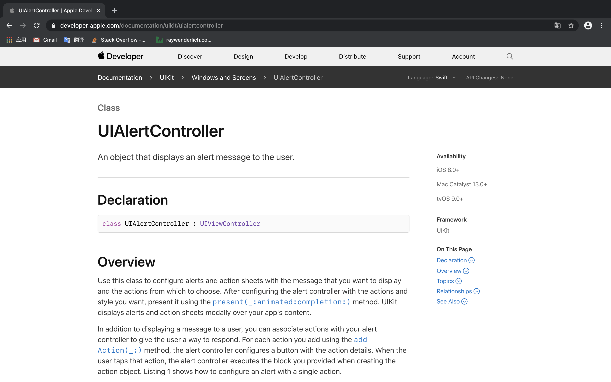
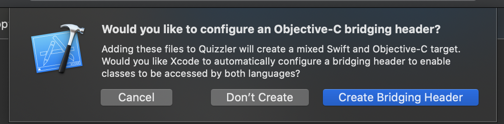
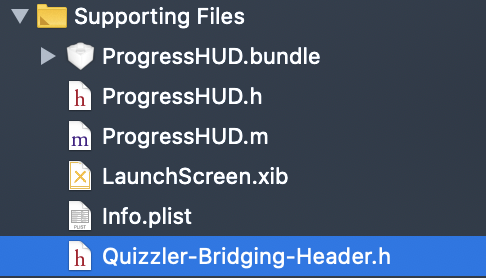

# 趣味问答APP

## MVC模式：Model-View-Controller

iOS开发使用的设计模式是MVC模式。Model（模型）和View（视图）没有直接交流，而是通过中间层Controller（控制器）来进行沟通。

iOS开发中，类名基本都是 `*Controller`之类的形式，这种类就是控制器。

## 弹出框功能

使用Google搜索：alert apple documentation，最后在结果中找到靠前的。



在Overview框中往下看，可以看到示例代码：

```swift
let alert = UIAlertController(title: "My Alert", message: "This is an alert.", preferredStyle: .alert) 
alert.addAction(UIAlertAction(title: NSLocalizedString("OK", comment: "Default action"), style: .default, handler: { _ in 
NSLog("The \"OK\" alert occured.")
}))
self.present(alert, animated: true, completion: nil)
```

可以看到，弹出框是一个类：`UIAlertController`，它还是一个控制器。

## 如何使用第三方库？

当我们想要实现一个功能，而这个功能我们不会实现（emm，我觉得通常都是这样）或者实现起来比较麻烦，我们就可以上万能的 `Github`上找别人的开源项目了。

例如本项目中要使用到的提醒功能，就是在Github上找的：[relatedcode](https://github.com/relatedcode)/**[ProgressHUD](https://github.com/relatedcode/ProgressHUD)**

这位大佬好像以前出过OC版本的。现在这个版本是他今年重新出来的诶。真牛逼啊👍。

通常找到这样的开源项目之后，在它的Readme文件中也有如何使用的介绍。

查看即可。

如果要使用的第三方库是使用OC写的，那么在把文件拖入项目中时，将会出现一下弹窗：



点击Create Bridging Header按钮，然后在生成的 `项目名-Bridging-Header.h`文件中用OC语法倒入要使用的东西的头文件即可。

例如我们这里是这样的：



然后在这个头文件中引入 `ProgressHUD.h`即可：

```objective-c
//
//  Use this file to import your target's public headers that you would like to expose to Swift.
//

#import "ProgressHUD.h"
```

现在就可以在Swift文件中使用了。

