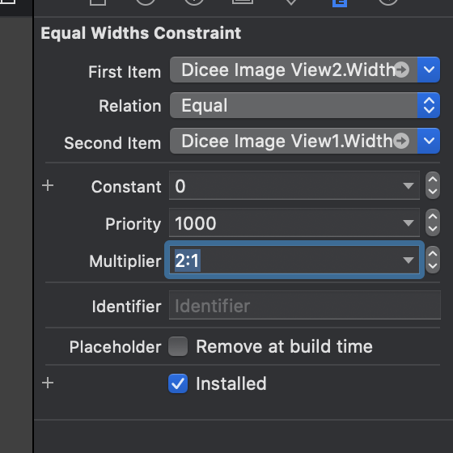
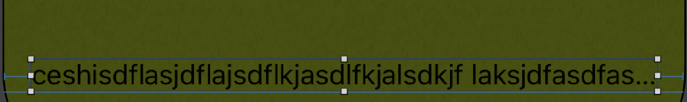
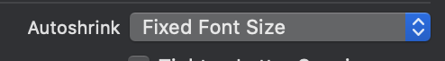
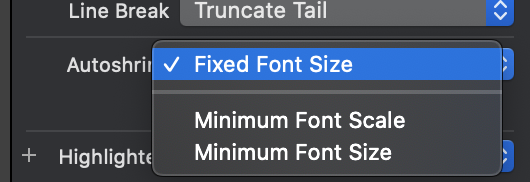

# 摇骰子 + AutoLayout

## Auto Resizing

在学习Autolayout之前，先来看看Auto Resizing技术。这个技术出现在 Autolayout之前，在Autolayout发布之前，我们使用的是Auto Resizing技术来对不同尺寸的屏幕进行适配。

另外，Autolayout技术和Auto Resizing技术不能共存，是互斥的。如果我们使用代码来写Autolayout时，需要注意首先应该去掉Auto Resizing。（现在先提一嘴，后面会说的）。

Auto Resizing有些布局是无法实现的。具体内容就略过了。

## StackView

StackView可以用于快速布局出好看的页面。

StackView有两种方向：Horizontal 以及 Vertical。

通常我们使用StackView进行布局是不断的嵌套StackView。

## 拉伸优先级以及压缩优先级

拉伸优先级：Content Hugging Priority

压缩优先级：Content Compress Resistance Priority

优先级越高，越不被拉伸/压缩。

## 约束 Constraints

约束是iOS中的万能布局。使用约束可以完成全尺寸设备的适配。

要确定一个控件的位置，通常需要使用两个约束：水平方向一个约束，以及垂直方向一个约束。

将控件设置为屏幕宽度/高度的 几分之一做法：

1. 先把控件和根view设置为等高/等宽
2. 找到这个约束，双击。
3. 修改Multiplier属性

例如设置Multiplier的值为 `2:1`，则会把First Item 和 Second Item的宽度/高度设置为 `2:1`（当前属性是宽度）。

另外，可以看到有一个Constant属性。

准确的来讲，`First Item的值 = Second Item的值 * Multipier + Constant`

另外有一个属性我们来看看：

Autoshrink：自动缩放字体。

当我们遇到这样的场景：我们在画面的最下面有一个版权的声明消息，它是一个label，我们需要它水平居中，然后距离下margin 0 point。即我们设置它距离左边 16 point 右边 16point然后下面距离0point。

如果我们的文字比较多，那么在较小的屏幕中，文字的内容一定会被压缩。现在我们就可以使用Autoshrink属性来自动缩放字体。

既然我们说的是属性，那么它一定是在属性检查器中：

AutoShrink属性有三个可选值：

默认情况下，选中的为`Fixed Font Size`。这个属性表示固定字体大小，即不缩放。

下面的Minimum Font Scale和Minimum Font Size分别表示 最小缩放的比例以及最小缩放尺寸。

我们可以选择Minimum Font Scale然后设置为合适的值即可。

注意：假如这个值被设为0.5，那么说的是最小可被缩放为0.5倍，如果需要缩小的倍数大于0.5，例如0.8，那么最后缩小的倍数为0.8。