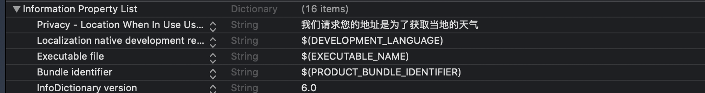

# 天气APP

我们将在天气APP的构建当中学到Cocoapods的知识（Cocoapods指的是项目管理工具）。

## 项目管理工具 Cocoapods的使用

使用Cocoapods的方式有两种：

* 使用命令行工具
* 使用Cocoapods提供的App

第二种方式，使用它的App会有一些小问题。最后还是需要使用命令行工具。

命令行工具的安装，我们使用Macos 自带的Ruby gem工具。但安装Cocoapods之前，我们首先需要重设gem安装源。

这里列出了一些gem的使用方法：

1. 查看当前安装源

   ```shell
   gem sources -l
   ```

2. 移除某个安装源

   ```shell
   gem sources --remove http://rubygems.org/ # 例如移除默认的安装源
   ```

   

3. 添加安装源

   ```shell
   gem sources -a https://ruby-china.org	# 添加为国内的镜像安装源
   ```

   

在这之后就可以开始安装Cocoapods了。

```shell
sudo gem install cocoapods
```

现在我们可以来解决 Cocoapods app的小问题：“无法通过New Podfile from Xcode Project(Command+N)新建Podfile的解决方案”了。

近期由于macOS和Xcode的正式版本没有同步发行的原因，导致了一些Mac上的App的部分功能没法用的情况。

比较典型的就是cocoapods的App。

解决方案：

1. 打开Mac自带的终端App：


2. 输入`sudo gem install cocoapods` 按回车


注：这一步是安装了cocoapods的命令行工具，也就是说以后我们也可以从终端里面来操作cocoapods了。

3. 输入Mac开机密码（直接敲，终端上不会显示），按回车，并等待安装完成（出现`1 gem installed`的字眼即表示安装完成）。

4. 输入`cd xxx`（xxx为项目文件夹的路径，可以直接从finder里面把项目的总文件夹拖进来），按回车

**注：cd后面有一个空格**：


5.输入`pod init`，按回车

6.打开Cocopods的App，按Command+O打开项目文件夹里面的podfile文件:


就会弹出这样的画面了：


注：

以后别的项目的话从第四步开始做起就可以了。


作者：Lebus
链接：https://juejin.im/post/6844904031689637895


在Podfile里面引入需要使用的第三方库即可。

```shell
# Uncomment the next line to define a global platform for your project
# platform :ios, '9.0'

target 'Climate' do
  # Comment the next line if you don't want to use dynamic frameworks
  use_frameworks!

  # Pods for Climate
  pod 'SVProgressHUD'

end
```

可以看到，首先键入 `pod`，然后单引号中放入第三方库名。这是固定格式。

到了这里之后，我们就可以点击App右上角的 Install 按钮了。

但现在我们还有一个问题：在第一次使用cocoapods的时候，因为他需要**先**把所有iOS库的索引都下载下来，所以难免会出现下载慢或出错的情况。

最经典的错误：

```
error: RPC failed; result=18, HTTP code = 200

fatal: The remote end hung up unexpectedly

fatal: early EOF

fatal: index-pack failed

[!] Unable to add a source with url [github.com/CocoaPods/S…](https://github.com/CocoaPods/Specs.git) named master. You can try adding it manually in ~/.cocoapods/repos or via pod repo add
```


解决方法(使用清华镜像)：

下载全部包的索引

1.打开Mac上的终端（或别的命令行工具）  

2.输入`rm -rf ~/.cocoapods` 按回车，等1-2秒，直至左边有光标显示即可

3.输入`mkdir -p ~/.cocoapods/repos`按回车

4.输入`cd ~/.cocoapods/repos`按回车

5.输入`git clone https://mirrors.tuna.tsinghua.edu.cn/git/CocoaPods/Specs.git master`按回车，等待完成（约几分钟，速度为5-10M/s）。

作者：Lebus
链接：https://juejin.im/post/6844903828177813518
来源：掘金
著作权归作者所有。商业转载请联系作者获得授权，非商业转载请注明出处。

现在，终于配置好了。

## 获取用户当前位置

我们将使用苹果提供的 CoreLocation模块来获取用户当前位置。

使用步骤：

1. import CoreLocation 倒入 CoreLocation包
2. 在ViewController中定义一个 CLLocationManager 。需要它是ViewController的成员。我觉得应该也是强指针的问题，等会儿试试
3. 在viewWillApear方法里面初始化
4. 遵守CLLocationManagerDelegate代理
5. 设置locationManager的委托对象为ViewController
6. 定义必要的方法
7. 添加错误处理函数（也是协议中的函数）
8. 在Info.plist文件中提供描述

示例：

```swift
import UIKit
import CoreLocation // 第一步：导入CoreLocation包

class ViewController: UIViewController,CLLocationManagerDelegate { // 第四步：遵守CLLocationManagerDelegate协议

    let locationManager = CLLocationManager()   //  第二步：定义一个CLLocationManager对象
    override func viewDidLoad() {
        super.viewDidLoad()
        // Do any additional setup after loading the view.
        locationManager.delegate = self //第五步：设置locationManager的委托对象
    }
    
    override func viewWillAppear(_ animated: Bool) {
        super.viewWillAppear(animated)
        //第三步：在viewWillAppear方法中初始化locationManager
        locationManager.requestWhenInUseAuthorization() //请求授权获取当前位置
        locationManager.desiredAccuracy = kCLLocationAccuracyHundredMeters //设置位置精度越高，耗电越大
        locationManager.requestLocation() //请求用户位置 -- 只请求一次 这个调用会使用locationManager的代理的方法
    }
    
    
    //第六步：定义必要的方法
    func locationManager(_ manager: CLLocationManager, didUpdateLocations locations: [CLLocation]) {
        let lat = locations[0].coordinate.latitude
        let lon = locations[0].coordinate.longitude
        print(lat,lon)
    }
    
    //第七步：实现错误处理函数
    func locationManager(_ manager: CLLocationManager, didFailWithError error: Error) {
        print(error)
    }
}

```

然后在info.plist文件中添加描述：




## 天气API

这里使用的为 OpenWeatherMap 的API。

去这个网站上阅读API就能知道怎么使用它了。

## 使用网络请求功能包Alamofire完成http请求获取天气数据

首先在Cocoapods.org网站中找到Alamofire：


然后重新打开Cocoapods App，然后修改代码为以下：

```ruby
# Uncomment the next line to define a global platform for your project
# platform :ios, '9.0'

target 'Climate' do
  # Comment the next line if you don't want to use dynamic frameworks
  use_frameworks!

  # Pods for Climate
  pod 'SVProgressHUD'
  pod 'Alamofire'

end
```

即添加 `pod 'Alamofire'`

现在我们只需要导入Alamofire模块即可。

```swift
import Alamofie
```

另外，Alamofire的使用方法在网站上就有。通常看Making a Request 部分以及 Responding Handling部分。

## JSON 和 SwiftyJSON

SwiftyJSON的使用：

首先将在cocoapods软件中引入SwiftyJSON。

然后直接在swift文件中导入 SwiftyJSON包即可。

它的具体用法可以在CocoaPods中找到。它的Subscript很好用。

### Initialization

```swift
import SwiftyJSON
let json = JSON(data: dataFromNetworking)
//或是
let json = JSON(jsonObject)
// 或是
if let dataFromString = jsonString.data(using: .utf8, allowLossyConversion: false) {
    let json = JSON(data: dataFromString)
}
```

### Subscript

```swift
// Getting a double from a JSON Array
let name = json[0].double

// Getting an array of string from a JSON Array
let arrayNames =  json["users"].arrayValue.map {$0["name"].stringValue}

// Getting a string from a JSON Dictionary
let name = json["name"].stringValue

// Getting a string using a path to the element
let path: [JSONSubscriptType] = [1,"list",2,"name"]
let name = json[path].string
// Just the same
let name = json[1]["list"][2]["name"].string
// Alternatively
let name = json[1,"list",2,"name"].string
```

可以看到，要获取字符串，有两种方式，一种是使用 stringValue，一种是string。它们的主要区别是：

* stringValue：获取字符串，如果调用者是空，则返回一个空字符串。建议用这个
* string：获取字符串，如果调用者是空，则返回空。所以不建议用这个

## 界面跳转 Segue

在storyboard中进行多界面跳转的编辑时，如果有跳转，则会出现这样的东西：


上图中正中间的那个东西就是 Segue了。App通过Segue来进行跳转，并可以在跳转中传递数据。（正向跳转）。

### 正向传值

要使用它进行传值，我们首先需要预先设置一些属性。

选中这个Segue，然后在右边的属性检查器中找到 Identifier属性，设置它为合适的值。我们后面会使用到这个identifier来获取Segue。

现在进入到给第二个界面创建的ViewController类中。可以看到，模版文件中包含苹果给的提示：

```swift
/*
    // MARK: - Navigation

    // In a storyboard-based application, you will often want to do a little preparation before navigation
    override func prepare(for segue: UIStoryboardSegue, sender: Any?) {
        // Get the new view controller using segue.destination.
        // Pass the selected object to the new view controller.
    }
    */
```

Navigation即导航。

`segue.desination`属性即目的地，表示要跳转到的位置。它是一个UIViewController类型的对象。通过这个对象我们就可以给要跳转的界面传递数据了。

`segue.identifier`属性表示segue的标识符，通过这个属性我们可以区分不同的segue。（需要区分的理由是一个界面可能要跳转的界面有多个，就有多个segue）。

例子：

第一个Controller：

```swift
override func prepare(for segue: UIStoryboardSegue, sender: Any?) {

  if(segue.identifier == "selectCity" ){
    let vc  = segue.destination as! SelectCityViewController
    vc.data = "HELLO,MY NEXT!"
  }
}
```

目的地Controller：

```swift
import UIKit

class SelectCityViewController: UIViewController {

    var data = ""
    override func viewDidLoad() {
        super.viewDidLoad()
        print("data：\(data)")
        // Do any additional setup after loading the view.
    }
}
```

### 反向传值

要实现反向传值，我们不能在第二个界面上再新建一个segue到第一个界面。如果这样做了，那会新建一个和第一个界面相同的界面，而这个界面实际上是第三个界面。

我们需要使用其他的方法。

例如：委托。

使用委托的步骤：

1. 在本界面定义委托协议。通常协议的名称为 名+Delegate。例如：SelectCityDelegate
2. 在协议中定义一个方法。要反向传递的值作为参数
3. 在本类中添加一个delegate属性，通常设置为 `var delegate:SelectCityDelegate?`可选值
4. 本类中，在需要传递值的地方调用 代理方法
5. 在要传递的界面 首先让它遵守 委托协议
6. 在prepare方法中设置 本界面ViewController的delegate为 要传递的界面本身
7. 实现对应方法，在里面就可以取到值了。

例子：

第二个界面：

```swift
import UIKit

protocol SelectCityDelegate {
    func didChangeCity(city:String)
}

class SelectCityViewController: UIViewController {

    @IBOutlet weak var inputTextF: UITextField!
    var delegate:SelectCityDelegate?
    override func viewDidLoad() {
        super.viewDidLoad()
        // Do any additional setup after loading the view.
    }
    
    @IBAction func queryWeather(_ sender: Any) {
        delegate?.didChangeCity(city: inputTextF.text!)
    }
}

```

第一个界面：

```swift
import UIKit
import CoreLocation // 第一步：导入CoreLocation包
import Alamofire
import SwiftyJSON
import SVProgressHUD

class ViewController: UIViewController,CLLocationManagerDelegate,SelectCityDelegate {
    // 第四步：遵守CLLocationManagerDelegate协议

    
    @IBOutlet weak var cityLabel: UILabel!
    @IBOutlet weak var tempLabel: UILabel!
    @IBOutlet weak var weatherImage: UIImageView!
    
    let weather = Weather()
    
    let locationManager = CLLocationManager()   //  第二步：定义一个CLLocationManager对象
    override func viewDidLoad() {
        super.viewDidLoad()
        // Do any additional setup after loading the view.
        locationManager.delegate = self //第五步：设置locationManager的委托对象
    }
    
    override func viewWillAppear(_ animated: Bool) {
        super.viewWillAppear(animated)
        //第三步：在viewWillAppear方法中初始化locationManager
        locationManager.requestWhenInUseAuthorization() //请求授权获取当前位置
        locationManager.desiredAccuracy = kCLLocationAccuracyHundredMeters //设置位置精度越高，耗电越大
        locationManager.requestLocation() //请求用户位置 -- 只请求一次 这个调用会使用locationManager的代理的方法
    }
    
    
    //第六步：定义必要的方法
    func locationManager(_ manager: CLLocationManager, didUpdateLocations locations: [CLLocation]) {
        let lat = locations[0].coordinate.latitude
        let lon = locations[0].coordinate.longitude
        print(lat,lon)
        let params = ["lat":"\(lat)","lon":"\(lon)","appid":"ea82790127031a954597502b1c33586c"]
        AF.request("https://api.openweathermap.org/data/2.5/weather",parameters: params).responseJSON { response in
            if let json = response.value{
                let weather = JSON(json)
                self.weather.city = weather["name"].stringValue
                self.weather.temp = Int(round(weather["main","temp"].doubleValue-273.15))
                self.weather.condition = weather["weather",0,"id"].intValue
                self.updateUI()
            }
        }
        
    }  
    
    //第七步：实现错误处理函数
    func locationManager(_ manager: CLLocationManager, didFailWithError error: Error) {
        print(error)
    }
    
    func updateUI(){
        cityLabel.text = weather.city
        tempLabel.text = "\(weather.temp)˚"
        weatherImage.image = UIImage(named: weather.icon)
        
    }
    
    func didChangeCity(city: String) {
        print(city)
    }
    
    override func prepare(for segue: UIStoryboardSegue, sender: Any?) {
        
        if(segue.identifier == "selectCity" ){
            let vc  = segue.destination as! SelectCityViewController
            vc.data = "HELLO,MY NEXT!"
            vc.delegate = self
        }
    }
}
```

